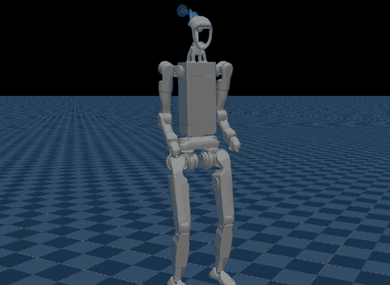

# H1-2 Velocity Walking (`bipedhrl`)



Source: https://github.com/spaethli/biped_hrl (Apache-2.0; the H1-2 model is Unitree's,
BSD-3-Clause)

A Unitree H1-2 walking to velocity commands with A0, the flat PPO baseline of a thesis on
hierarchical RL, using the checkpoint its author ran on the real robot. The command is
resampled every 3 to 8 s, as upstream's play config draws it, and mjlab's joystick panel
can take over.

## Run

```sh
uv run msp run bipedhrl
```

The build clones the repository into `.cache/` at a pinned commit; set
`MJSWAN_BIPEDHRL_ROOT` to point at a checkout you already have. Upstream runs from source
as the top-level package `src`, so [`upstream.py`](upstream.py) puts the checkout first on
`sys.path` and imports `src.tasks.velocity.config.h1_2`, which registers the task.

| From `biped_hrl` | Used as |
|---|---|
| `Unitree-H1_2-Flat` (`play=True`) | the scene, the observations, the action term, the terminations and the startup randomization |
| `deploy/robots/h1_2/config/policy/velocity/v0/exported/policy.onnx` | the policy (92 → 27), already exported; its mjlab metadata gives the joint order and the rest pose |

That checkpoint is the one the deploy config pairs with `params/deploy.yaml`. Its
`PROVENANCE.json` traces it to run `2026-09-09_19-36-21_fmem_payload_standing12_s123`,
trained on `Unitree-H1_2-Flat-Payload`, whose play config is `Unitree-H1_2-Flat`'s.

## What the policy reads

Seven terms, one frame, no history:

| Term | Width | Source |
|---|---|---|
| `base_ang_vel` | 3 | the `imu_ang_vel` sensor |
| `projected_gravity` | 3 | `projected_gravity_b` |
| `command` | 3 | the `twist` command |
| `phase` | 2 | sin and cos of a 0.6 s gait clock, zero while the command is below 0.1 |
| `joint_pos` / `joint_vel` | 27 each | `joint_pos_rel` / `joint_vel_rel` |
| `actions` | 27 | the previous action |

## What differs from upstream

- **The gait clock is a command term.** Upstream's `phase` reads `env.episode_length_buf`,
  which the browser does not serve. [`terms.py`](terms.py) counts control steps in a
  `gait_clock` command that restarts on reset, and the observation reads its `step_count`
  and the twist's `vel_command_b` directly: the browser serves a traced command to a
  graph by state field, not through `get_command()`.
  Against upstream's own `phase` in a one-env mjlab env it agrees to within 1e-5 over
  1,400 steps, across ten auto-resets and two manual ones. In the browser, the clock runs one step ahead
  after a fall until the next manual reset: mjswan updates a command once more right
  after resetting it.
- **The joystick leaves the standing gate alone.** mjswan feeds a traced term the
  command's own state, not the joystick's override, so with the joystick on, `phase` is
  zero while the resampled command is below 0.1, whatever the sliders say. At zero
  sliders the robot keeps stepping and drifts about 0.5 m in 15 s, and a sideways or
  turning slider can reach under half its speed.
- **mjlab 1.6.0.** Upstream asks for `mjlab>=1.3.0` and locks none; its robot constants
  build `CollisionCfg` without the fields 1.6.0 made required, so `upstream.py` fills in
  the old defaults while importing it.
- **No encoder bias.** mjlab's play config draws a ±0.015 rad bias per joint at startup;
  the browser applies the policy config's `encoder_bias` instead, and the checkpoint
  carries none.
- **One randomized robot, not a population.** The CoM offset on `torso_link` and the foot
  friction (0.3 to 1.6) are drawn once from the browser's seeded PRNG, where mjlab draws
  them per env.
- **No terrain re-draw.** `randomize_terrain` picks a sub-terrain per reset; the flat task
  has one plane, so it does nothing in either.

## License

The code and checkpoint are Apache-2.0, under biped_hrl's `LICENCE`, which the build
ships as the project's `LICENSE`. The H1-2 model is Unitree's: biped_hrl inherits it
unchanged from [unitree_rl_mjlab](https://github.com/unitreerobotics/unitree_rl_mjlab),
where it has no license file of its own. Its meshes are byte for byte those of Unitree's
[`h1_2_description`](https://github.com/unitreerobotics/unitree_ros/tree/master/robots/h1_2_description),
and its MJCF is that package's `h1_2_handless.xml` rewritten for mjlab (the same bodies,
inertias, joints and meshes, with collision capsules, sites and sensors added). Unitree
publishes the package under BSD-3-Clause, Copyright (c) 2016-2022 HangZhou YuShu
TECHNOLOGY CO.,LTD. ("Unitree Robotics"), and the scene carries that notice as
`LICENSE.unitree_h1_2`.
