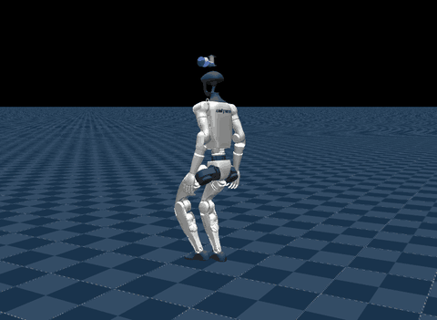

# G1 DUET (`duet`)



Source: https://github.com/bae-air-lab/DUET (Apache-2.0; code, model and checkpoint; the
G1-23DOF model is Unitree's, BSD-3-Clause)

A 23-DOF Unitree G1 walking and squatting with DUET's lower-body policy, the checkpoint
its paper deploys on hardware. The policy drives the twelve leg joints and the waist yaw
to a commanded twist and a pelvis height from 0.73 m down to a 0.18 m crouch; the arms are
not its actions and hold their default pose. Both commands resample every 3 to 8 s as
upstream's play config draws them, and the control panel can take over either: mjlab's
joystick for the twist, an Enable box and a height slider for the squat.

## Run

```sh
uv run msp run duet
```

The build clones the repository into `.cache/` at a pinned commit; set `MJSWAN_DUET_ROOT`
to point at a checkout you already have. Upstream runs from source as the top-level
package `src`, so [`upstream.py`](upstream.py) puts the checkout first on `sys.path` and
imports `src.tasks.duet.config.g1_23dof`, which registers the task.

| From `DUET` | Used as |
|---|---|
| `Unitree-G1-23Dof-Duet-Flat` (`play=True`) | the scene, the observations, the action term, the commands, the terminations and the events |
| `exported/policy.onnx` | the policy (71 → 13), model_15500, already exported |
| `exported/deploy_contract.json` | the action joints, their offsets and the height range the checkpoint was trained on |
| `LICENCE` | the project's `LICENSE` |

## What the policy reads

Eight terms, one frame, no history:

| Term | Width | Source |
|---|---|---|
| `base_ang_vel` | 3 | the `imu_ang_vel` sensor |
| `projected_gravity` | 3 | `projected_gravity_b` |
| `command` | 3 | the `twist` command |
| `phase` | 2 | sin and cos of a 0.6 s gait clock, zero while the twist is below 0.1 |
| `joint_pos` / `joint_vel` | 23 each | `joint_pos_rel` / `joint_vel_rel`, arms included |
| `actions` | 13 | the previous action |
| `height_command` | 1 | the `base_height` command |

## What differs from upstream

- **The arms hold still.** Play sets upstream's `UpperBodyPoseActionCfg`, the arm
  disturbance generator, to keep the arms at their default pose, and mjswan has no
  counterpart for that task-specific action, so it is dropped. Two training-side terms
  read it and go with it: the critic's `arm_traj_vel` and the `arm_traj_speed` and
  `arm_traj_accel` metrics.
- **The gait clock is a command term**, shared with `bipedhrl`. Upstream's `phase` reads
  `env.episode_length_buf`, which the browser does not serve;
  [`_gait_clock.py`](../_gait_clock.py) counts control steps in a `gait_clock` command
  that restarts on reset.
- **The height command picks its target in the observation.** Upstream's
  `BaseHeightCommand` holds a squat target and a walk target and, each step, reads the
  twist command to choose the walk target while moving. A browser command cannot read
  another command, so [`terms.py`](terms.py) binds it with its value pinned to the squat
  target, and `height_command` makes the same choice from both commands. Its resampling
  is restated as one graph; its panel is upstream's `create_gui`, written out because the
  slider's range does not straddle zero.
- **The height range is the checkpoint's.** model_15500 was trained on 0.18 to 0.73 m,
  as its deploy contract says; upstream has since moved the config to 0.24 to 0.78 m.
  The squat floor is pinned at 0.18 m, play's full depth.
- **Payload randomization has no graph.** `hand_payload` and `torso_payload` add a random
  mass on reset through `dr.body_mass`, which reads `env.sim` and so does not trace;
  parity leaves them to the browser's native model-field randomization, unchecked.
- **mjlab 1.6.0.** Upstream pins `mjlab==1.2.0`. `upstream.py` fills in the
  `CollisionCfg` defaults 1.6.0 made required, restores `mjlab.utils.os.update_assets`
  for the robot's mesh loading, and passes `BaseHeightCommand` the `env_ids` argument
  1.6.0 added to `compute` and `_update_command`.
