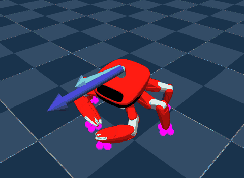

# Jumper (`jumper`)



Source: https://github.com/KingKongRobotics/jumper (Apache-2.0; code, robot model,
checkpoints and the dance and gesture clips; its `NOTICE` names the third-party files it
vendors)

KingKong Robotics' Jumper, a 22-joint crab robot, running every policy upstream ships a
checkpoint for, on four scenes:

- **Jumper-Posture** walks on a tripod gait while it holds a commanded body posture: a
  twist over its planted feet, a pitch, a roll and a body height from 0.07 m to 0.15 m.
- **Jumper-Five-Foot** walks on five legs with the left-front leg folded as an open claw,
  holding a commanded body pitch, roll and twist.
- **Jumper-Dance** runs nine policies, each playing its own clip once per episode: four
  gestures (Hello, Bow, Paw, Salute) and five dances (Maze, Waist, Dream Wings, Brazilian
  and the longer Demo).
- **Jumper-Jump** jumps high, once per episode: Jump adds its residual to a recorded
  crouch-jump-tuck-land, and Jump (no reference) observes the robot alone.

Every command resamples as upstream's play config draws it. On the two walking scenes,
mjlab's joystick takes over the walk, and an Enable box with sliders the posture.

## Run

```sh
uv run msp run jumper
```

The build clones the repository into `.cache/` at a pinned commit; set
`MJSWAN_JUMPER_ROOT` to point at a checkout you already have. Each dance task converts its
clip into `media/.cache/` the first time its config is built.

| From `jumper` | Used as |
|---|---|
| `jumper.<task>` (`play=True`) | each policy's scene, observations, action term, commands, terminations and events |
| `tasks/jumper/<task>/out/example/actor.onnx` | each policy, exported by upstream with its normalizer inside |
| `tasks/jumper/<task>/out/example/layout.json` | each policy's action joints, their default pose and the held joints' positions |
| `tasks/jumper/<task>/media/*.npz`, `tasks/jumper/jump/ref/high_jump_flat.npz` | the dance and gesture clips, and the jump's recording |
| `LICENSE`, `NOTICE` | the project's license and notice |

| Scene | Policy | Task | Checkpoint | Input → action | Rate |
|---|---|---|---|---|---|
| Jumper-Posture | model_74800 | `posture` | model_74800 | 415 → 20 | 200 Hz |
| Jumper-Five-Foot | model_86600 | `five_foot` | model_86600 | 407 → 16 | 50 Hz |
| Jumper-Dance | Hello, Bow, Paw, Salute | `gesture_*` | model_999 | 209 → 22 | 50 Hz |
| Jumper-Dance | Dance: Maze, Waist, Dream Wings, Brazilian | `dance_*` | model_1999 | 209 → 22 | 50 Hz |
| Jumper-Dance | Dance: Demo | `dance` | model_2300 | 209 → 22 | 50 Hz |
| Jumper-Jump | Jump | `jump` | model_3100 | 167 → 20 | 200 Hz |
| Jumper-Jump | Jump (no reference) | `ref_free_jump` | model_5999 | 406 → 20 | 200 Hz |

## What the policies read

**Posture**: nine terms. Four of them stack five frames 4 control steps (20 ms) apart,
oldest first:

| Term | Width | Source |
|---|---|---|
| `base_ang_vel` | 3 | the `imu_ang_vel` sensor |
| `projected_gravity` | 3 | `projected_gravity_b` |
| `joint_pos` | 5 × 20 | `joint_pos_rel` with the encoder bias, 16, 12, 8, 4 and 0 steps back |
| `joint_vel` | 5 × 20 | `joint_vel_rel`, same frames |
| `actions` | 5 × 20 | the previous action, same frames |
| `command` | 3 | the `twist` command |
| `actuator_force` | 5 × 20 | the servos' output, same frames |
| `gait_phase` | 2 | sin and cos of a gait clock whose cadence follows the twist, zero while standing |
| `posture_command` | 4 | twist, pitch, roll, and the height less the 0.10647 m standing height |

**Five-foot**: the same terms without the gait clock, over the 16 driven joints for the
action and 21 for the joints (the carried arm and its claw included), five frames each at
mjlab's own `history_length`, with `base_pose` (pitch, roll, twist) for the posture.

**Dances and gestures**: one frame of the robot (`base_ang_vel`, `projected_gravity`,
`joint_pos`, `joint_vel`, `actions` and `actuator_force`, 22 joints each) and of the clip:
`clip_phase` (sin and cos of the frame index over the clip's length), `ref_joint_pos`,
`ref_joint_vel`, `ref_future` (the reference 2, 5 and 10 frames ahead) and
`ref_tilt_error`.

**Jumps**: Jump reads one frame of the robot, `jump_phase` and `ref_future` (the
recording's joints at five times ahead). Jump (no reference) reads the robot alone, its
joints, actions and servo output stacked like posture's.

## What differs from upstream

**Every scene**

- **The servos run as plain PD.** Upstream's `ServoCurveActuatorCfg` subclasses
  `IdealPdActuatorCfg`, and mjswan runs it as that: kp 10 (20 for the jumps), kd 0.5,
  within the 1.746 N·m plateau, without its torque decay above 30.7 rad/s or its thermal
  derating toward 1.2 N·m. Walking never reaches the decay (posture's fastest joint
  peaks at 20.3 rad/s in mjlab); the jumps do, briefly (below).
- **The joints no action moves are held by position actuators.** Upstream's servo PD
  holds them at their position target. The browser applies PD to the action's joints
  alone and zeroes every other `ctrl`, so [`servos.py`](servos.py) gives them MuJoCo
  position actuators of the servos' gains and limit: the claws at 0 rad, and five-foot's
  carried arm biased to hold its pose at `ctrl = 0`.
- **An episode's first look at the servos is restated.** mjlab clears every position
  target on reset, so an episode's first observation carries the servos pushing toward 0;
  the browser resets to the keyframe, whose `ctrl` is the default pose.
  `servos.servo_force` computes that observation as mjlab's reset leaves it. Jump (no
  reference) takes it as its cue: without it, the robot stands still and never jumps.
- **The operator terms are mjlab's and the panel's.** Play's operator commands read a
  keyboard or a gamepad; posture's and five-foot's `twist` becomes mjlab's
  `UniformVelocityCommandCfg`, their posture commands become upstream's base
  `PostureCommandCfg` and `BodyPoseCommandCfg`, and the control panel takes their place.
  Play's ToF sensor, which only its viewer draws, is dropped, and so are the critic, the
  rewards, the metrics and the curricula, which only training reads.
- **Startup randomization.** Foot friction and the base's center of mass are drawn once
  at startup, and parity leaves them unchecked. Play also draws an encoder bias, which
  mjswan takes from the policy config instead; the checkpoints ship none, so it is zero.

**Posture and Jump (no reference)**

- **The strided history is mjswan's own.** Upstream wraps each stacked term in
  `StridedHistory`, which keeps a ring of 17 frames and emits every fourth. Here the
  wrapper is unwrapped and each term carries the same frames as `history_steps`
  `(16, 12, 8, 4, 0)`.

**Posture**

- **The gait clock is a command term.** Upstream's `VariableGaitClock` is an observation
  that integrates its own phase at a cadence set by the twist command. A browser
  observation holds no state, so [`terms.py`](terms.py) moves the integration into a
  `gait_clock` command that advances each step at the cadence the twist asked for on the
  step before, and restarts on reset. In mjlab it matches upstream's clock exactly.
- **The posture command's draw is restated as one graph.** Upstream's
  `PostureCommand._resample_command` writes per-env rows with `Tensor.uniform_`, which
  the tracer cannot follow; `terms.py` draws the same bands at one env. Its update moves
  only anchors that feed metrics, so it is dropped with them. The panel's sliders span
  the standing band; upstream's operator also clamps the angles to the narrower walking
  band while the twist moves, which the browser does not.

**Five-foot** ([`five_foot.py`](five_foot.py))

- **The arm holds the deploy contract's pose.** Upstream's `hold_carried_arm` event
  writes the arm's state and position target each reset, at a pose play samples within
  ±0.1 rad of the stow; the robot holds the stow itself. Here the joint reset writes the
  default pose, which is the stow, and the biased actuators hold it. Walking 5 s in
  mjlab, upstream's config and this one end 1.3 cm apart, the arm within 2.1 mrad.
- **The claw stays open.** Play's trigger (`gripper_teleop`) drives the claw and
  `play --hold` (`claw_hold`) starts with a prop in it, both from step-mode events the
  browser does not run; untouched play leaves the claw open, and so does this.
- **The body-pose command is restated as one graph**, as posture's is. Its sliders set
  the observed command directly, where the operator's would ramp at 30°/s, and span the
  standing bands; upstream's `hold_to_band` also clamps the operator's target to the
  narrower walking bands while the twist moves, which the browser does not. Upstream
  also zeroes the ramp when an episode starts; a traced command cannot tell that from a
  timed resample, and play's episodes end only in a fall.

**Dances and gestures** ([`dance.py`](dance.py))

- **The clip is a traced command.** mjswan's native `MotionCommand` serves neither the
  frame index nor the frames ahead that upstream observes, so a `ClipCommand` carries the
  clip as constants of its graph and writes the rows the terms read as state fields; the
  observations and terminations are restated over them. In mjlab every term matches
  upstream's exactly over a whole clip.
- **An episode plays the clip once.** Past the last frame, `MotionCommand` resamples and
  writes the first frame's state back within the episode; here `clip_end` ends the
  episode as a time-out on that step, and the reset writes the first frame again.
- **No reference ghost.** The browser draws its ghost from its own tracking command,
  which these scenes do not use.

**Jumps** ([`jump.py`](jump.py))

- **The jump's command keeps its own clock.** Upstream's command counts the go instant
  against `episode_length_buf`, its `reset_from_reference` event spawns the robot and
  hands the spawn phase over through an env side channel, and its action reads the
  recording itself. Here the event is dropped and `JumpClockCommand` counts against a
  clock of its own, writes the spawn on reset at the event's play phase, and publishes
  the residual's baseline for mjswan's `joint_position_reference` action; `jump_phase`,
  `ref_future` and `reference_diverged` read its `go_step`. In mjlab it jumps the same
  trajectory as upstream's command.
- **The browser's Jump peaks lower**: 0.211 m, against 0.233 m to 0.241 m in mjlab. It
  feeds the policy the same observations and applies the same servo torques, but its
  MuJoCo resolves the crouch's many contacts a little differently, and the push-off ends
  slower.
- **Each jump keeps its own time-out.** A scene traces every policy's terms against the
  first policy's env, whose episode length mjlab's `time_out` would read for both, so
  `time_out` here takes each policy's own as a step count.
- **Jump (no reference) ends each episode on its 2.5 s time-out.** Upstream's `back_home`
  ends it once the robot has landed and held its home pose for 20 steps, and its `jump`
  command feeds play nothing else; both go, so the robot stands about 0.8 s longer
  between jumps. Its `PriorFeedforwardJointPositionActionCfg` becomes mjlab's
  `JointPositionActionCfg`: the prior's feedforward is zero at this checkpoint's step
  count. It jumps to 0.349 m in the browser, against 0.352 m in mjlab.
- **The servos' speed decay does engage here**, but in mjlab dropping it moves either
  jump's apex by under 1 mm.
