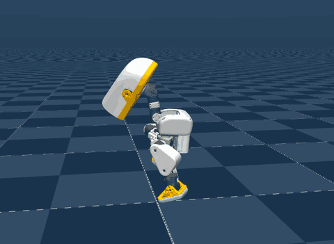

# Microduck Playground (`microduck_playground`)



Source: https://github.com/Vottivott/microduck-playground (Apache-2.0, **3D files
CC BY-NC-SA 4.0**, see [License](#license)) ·
policy from https://huggingface.co/HannesVonEssen/microduck-running (Apache-2.0)

The 25 cm Microduck sprinting on flat ground with a community running policy, at about
1.65 m/s. A Forward slider runs from 0 to 2.2 m/s.

## Run

```sh
uv run msp run microduck_playground
```

The first build clones microduck-playground into `.cache/` at a pinned commit (or reads
the checkout `MJSWAN_MICRODUCK_PLAYGROUND_ROOT` points at) and downloads the policy from
the Hub at a pinned revision.

| From upstream | Used as |
|---|---|
| `src/mjlab_microduck/robot/microduck/scene_walk.xml` | the scene: the model `Mjlab-Running-Flat-MicroDuck` trains on, `<position>` servos and all |
| its `STAND` keyframe | the reset pose, what actions offset from, and what `joint_pos_rel` subtracts |
| `policy.onnx` on the Hub at `9f45af1` (iteration 12195, normalizer baked in) | the policy, `obs[1, 61] -> actions[1, 14]` at 50 Hz |
| the policy's `manifest.json` | the command: forward speed trained through 2.2 m/s, lateral and yaw at 0 |
| `LICENSE`, `NOTICE`, `LICENSE-HARDWARE` | the project's license and notice, and the scene's attribution |

This is the same robot, servo order and 61-value contract as [`microduck`](../microduck/README.md),
so the task reuses that task's machinery and follows its shape: the scene compiles from
the XML rather than from upstream's env config, which drives the servos through BAM.

## What the policy reads

| Term | Width | Source |
|---|---|---|
| `base_ang_vel` | 3 | `root_link_ang_vel_b` |
| `projected_gravity` | 3 | `projected_gravity_b` |
| `joint_pos` | 14 | `joint_pos_rel`, against the `STAND` pose |
| `joint_vel` | 14 | `joint_vel_rel`, one control step back |
| `actions` | 14 | the previous action |
| twist | 3 | the Forward slider, then lateral and yaw at 0 |
| head, body | 4 + 6 | zeros |

## What differs from upstream

- **The servos are the XML's `<position>` actuators** (`kp` 0.55, ±0.96 N·m), not BAM,
  as in `microduck`.
- **The command delay is a filter.** Training delays every servo command by 3 to 6
  physics steps (15 to 30 ms) inside BAM. The browser has no actuator delay, so each
  servo gets a first-order `filterexact` filter with a 30 ms time constant, starting
  settled at `STAND`. Without it the policy falls within 2 s; with 20 ms it still falls a
  few times a minute in plain MuJoCo.
- **`joint_vel` reads one control step back** (`history_steps=(1,)`), the fixed lag
  training applies (`delay_min_lag = delay_max_lag = 1`) for the servo firmware's
  velocity estimate. The 0 to 1 step random lag on the gyro and gravity is dropped:
  zero is inside its range.
- **No domain randomization, no episode timeout**, no observation noise. The 70° fall
  reset is the velocity env's `fell_over`, which training keeps.
- **Lateral, yaw, head and body read zero**, where training samples ±0.02 m/s and
  ±0.05 rad/s of twist and small head and body ranges to keep those inputs alive.
- **The Forward slider starts at 1.0 m/s**, the play config's speed. The policy runs at
  its own pace whatever the command above a walk: the manifest's evaluations reach about
  1.65 m/s at a 2.2 m/s command.
- **`STAND` is the only keyframe**, with the root at 0.125 m, as in `microduck`.

## How it behaves

It runs straight from the reset and keeps running. Heading drifts over several seconds,
which the policy's manifest names as a known limit ("Heading and lateral drift remain
substantial"); there is no yaw command to correct it. The policy was never run on
hardware.

## License

The code and the policy are Apache-2.0. **The 3D files are not**: microduck-playground
licenses its hardware design files, the robot meshes from pollen-robotics/microduck_rl
among them, under Creative Commons BY-NC-SA 4.0 (`LICENSE-HARDWARE`, `NOTICE`), as
`microduck` does. NonCommercial and ShareAlike both bear on redistributing the compiled
scene, so the build declares `LICENSE-HARDWARE` as a scene attribution and `mjswan
publish` warns on it. Publishing a copy is the author's call under those terms.
